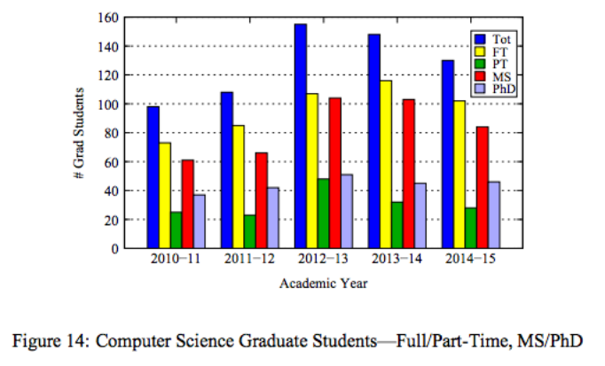

# Lab -- Making a Slopechart

Slopecharts are incredibly useful for comparing multiple values across two points in time.

Few people are aware of slopecharts, however, and instead use more familiar charts like bars or lines.

Your assignment is to take one of the charts below and, using d3, re-code it into a slopechart.
(These charts are from an actual WPI report from a person whose name rhymes with Wraig Cills, and could use some work :wink:)
Feel free to approximate the data from the chart if the attached datasets (which were also estimated) are not up to your standards of precision.

For a challenge, experiment with interaction, color, size, and more of the visual channels we discussed in class.
For a double-challenge, think about what best shows trends in the data **beyond** a slope chart.

